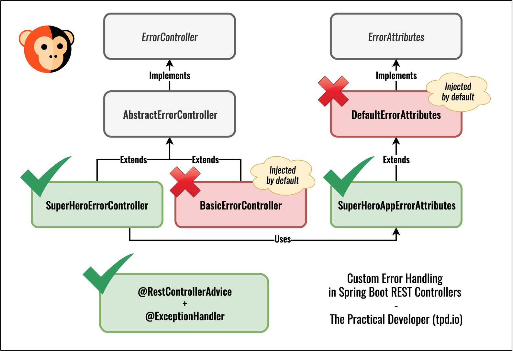

# Handling errors in REST Controllers with Spring Boot

## Goal 

This sample code shows how configure a Spring Boot application to properly handle all exceptions and create your custom error format.

Check the [blog post](https://thepracticaldeveloper.com/2019/09/09/custom-error-handling-rest-controllers-spring-boot/) on ThePracticalDeveloper site for the complete guide with instructions.

And, if you find this code useful, please give a star to the repo!

## Custom error handling

First, you'll find in this code an example of a basic approach to map exceptions to status codes in Spring Boot using a `@RestControllerAdvice` with `@ExceptionHandler` methods.

However, the most interesting part is the injection of a customized `ErrorController` implementation and the overridden `ErrorAttributes` to achieve consistent responses when dealing with errors.

For this example, I used the Google JSON Style Guide but you can use any other known error formatting or create your own one.

Check [the guide](https://thepracticaldeveloper.com/2019/09/09/custom-error-handling-rest-controllers-spring-boot/) for more details. 
